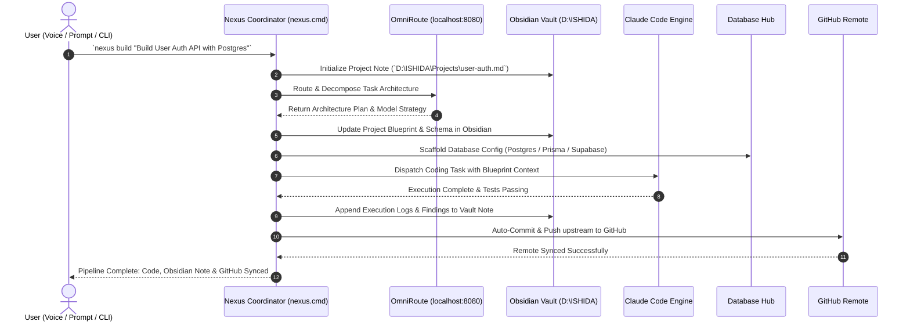

# 🌐 Nexus Pipeline SOP: OmniRoute + Claude + Obsidian + GitHub + Database

**Architecture Tier:** A.N.T. 3-Layer System  
**Pipeline Identity:** Nexus Orchestrator  
**Status:** Active  

---

## 1. Executive Overview

The **Nexus Pipeline** creates an automated, bidirectional bridge between five core development components:
1. **OmniRoute** (Intelligence Hub): Analyzes prompt complexity, determines task decomposition, and selects optimal models (Claude 3.7 Sonnet, DeepSeek, Local LLM, etc.).
2. **Claude Code** (Execution Engine): Handles complex code generation, refactoring, package management, and tool execution.
3. **Obsidian** (Knowledge & Data Vault): Serves as the Single Source of Truth (SSOT) at `D:\ISHIDA\Projects\<ProjectName>` for blueprints, schemas, architectural decision records (ADRs), and execution logs.
4. **GitHub** (Version Control & Remote Backup): Automatically stages, formats semantic commits, and pushes code to upstream GitHub repositories.
5. **Database Hub** (Persistence Layer): Generates database schemas, connection strings, migrations, and ORM configs (Prisma/Drizzle/Supabase/SQLite/Postgres).

---

## 2. Component Interaction Lifecycle

---

## 3. Data Invariants & Directory Separation

- **Code Workspace**: Stored at `d:\ZORO\` or dedicated project workspace. Never clutter Obsidian with raw `node_modules` or build artifacts.
- **Obsidian Vault Directory**: `D:\ISHIDA\Projects\`
  - Note naming convention: `<project-slug>.md`
  - Frontmatter metadata: `title`, `tags`, `github_repo`, `database_type`, `last_synced`, `status`.
- **Git Sync Rules**:
  - Always verify `.gitignore` contains sensitive patterns (`.env`, `node_modules/`, `.tmp/`, `credentials*`).
  - Git executable path: `C:\Program Files\Git\cmd\git.exe` with standard Windows fallback.
  - Commits format: `feat(<project>): <automated-change-summary> [nexus-sync]`

---

## 4. Error Handling & Self-Annealing

1. **OmniRoute Unavailable**: Fall back to direct local CLI execution or default Claude Code execution.
2. **Obsidian Vault Offline / Path Missing**: Cache updates in local `.tmp/obsidian_cache.json` and sync when vault is reachable.
3. **GitHub Remote Unreachable / Auth Failure**: Commit locally with clear warning tag and queue push retry without blocking workspace progress.
4. **Database Scaffolding Conflicts**: Create timestamped migrations/schemas rather than overwriting existing schemas.
